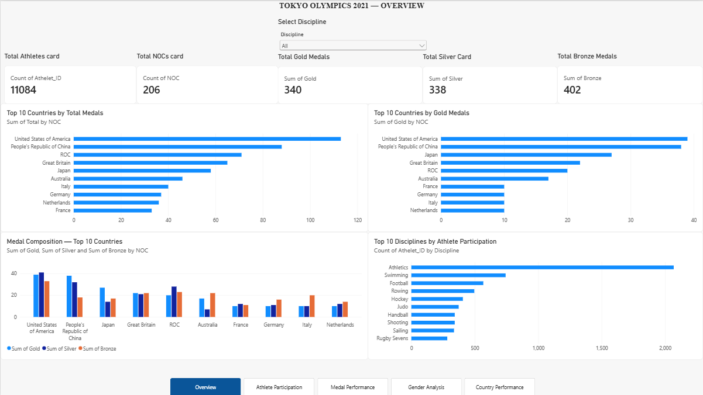
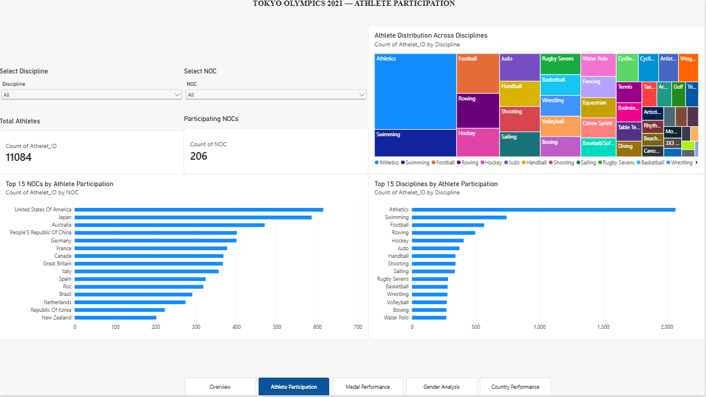
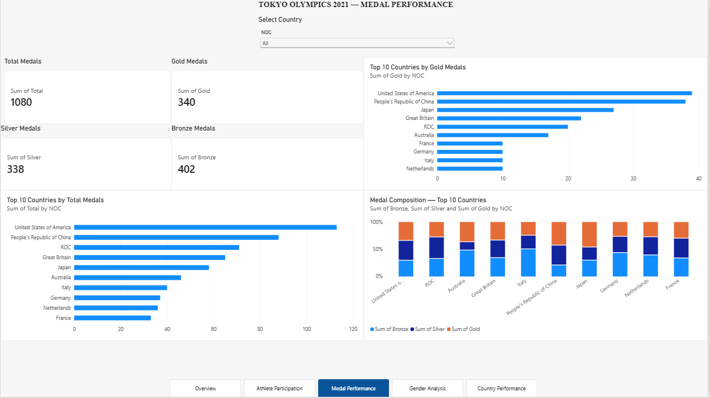
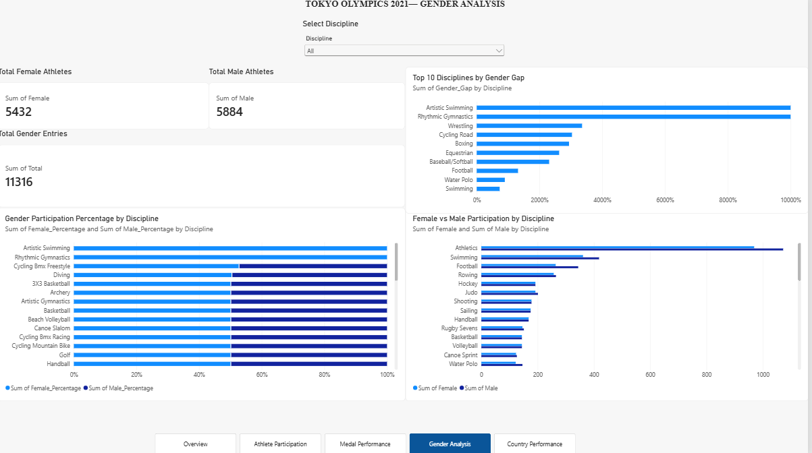
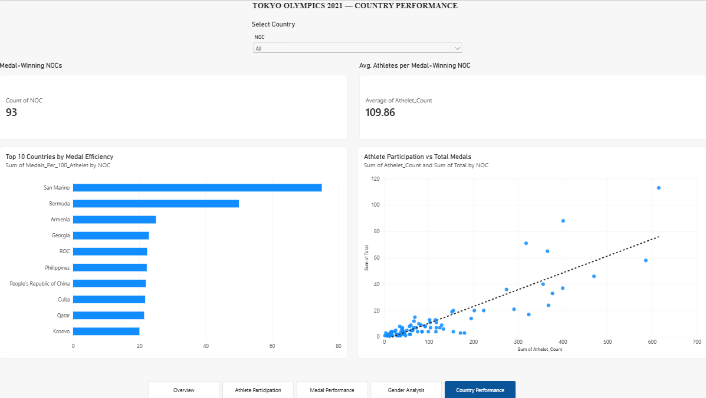

# 🏅 Tokyo Olympics 2021 — Data Analysis & Power BI Dashboard

## 📌 Project Overview

This project analyzes the **Tokyo 2021 Olympics dataset** using Python for data cleaning, feature engineering, and Exploratory Data Analysis (EDA), followed by an interactive **5-page Power BI dashboard**.

The goal of this project is to understand athlete participation, country performance, medal distribution, gender participation, and medal efficiency through data-driven analysis and visualization.

---

## 🎯 Objectives

* Clean and prepare multiple Olympic datasets for analysis
* Handle missing and duplicate values
* Perform exploratory data analysis using Python and Pandas
* Create useful features for deeper analysis
* Analyze athlete participation by country and discipline
* Analyze Gold, Silver, Bronze, and Total medals
* Compare female and male participation
* Analyze gender gaps across disciplines
* Compare athlete participation with medal performance
* Build an interactive Power BI dashboard
* Present the complete project as a portfolio data analytics project

---

## 📂 Dataset

The project uses multiple datasets related to the Tokyo 2020 Olympics:

| Dataset                      | Description                                     |
| ---------------------------- | ----------------------------------------------- |
| `athletes_cleaned.csv`       | Athlete names, NOC, and disciplines             |
| `coaches_cleaned.csv`        | Coaches, NOC, discipline, and event information |
| `entries_gender_cleaned.csv` | Female and male participation by discipline     |
| `medals_cleaned.csv`         | Medal counts and country rankings               |
| `teams_cleaned.csv`          | Team, NOC, discipline, and event information    |
| `country_performance.csv`    | Country-level athlete and medal performance     |

### Dataset Size

* **11,084 athlete records**
* **206 participating NOCs**
* **46 disciplines**
* **93 medal-winning NOCs**
* **394 coach records**
* **743 team records**

---

## 🧹 Data Cleaning

The datasets were inspected and cleaned before analysis.

The cleaning process included:

* Checking data types
* Checking missing values
* Checking duplicate records
* Removing duplicate athlete records
* Removing duplicate coach records
* Investigating missing event information
* Checking unique values and categorical variables
* Standardizing country/NOC values where required
* Verifying consistency between datasets

---

## ⚙️ Feature Engineering

Additional features were created to make the data more useful for analysis.

Examples include:

### Athlete ID

A unique identifier was created for athlete records.

### Gender Percentages

Female and male participation percentages were calculated:

```text
Female Percentage =
Female / Total × 100
```

```text
Male Percentage =
Male / Total × 100
```

### Gender Gap

The difference between female and male participation percentages was calculated:

```text
Gender Gap =
|Female Percentage - Male Percentage|
```

A smaller value represents a more gender-balanced discipline.

### Country Performance

A country-level performance dataset was created containing:

* Athlete count
* Gold medals
* Silver medals
* Bronze medals
* Total medals
* Medals per 100 athletes

The `Medals_Per_100_Athletes` feature was used to compare medal performance relative to athlete participation.

---

## 📊 Exploratory Data Analysis

The EDA explored questions such as:

### Athlete Participation

* How many athletes participated?
* How many NOCs participated?
* Which countries had the largest athlete delegations?
* Which disciplines had the highest athlete participation?

### Medal Performance

* Which countries won the most total medals?
* Which countries won the most gold medals?
* How were gold, silver, and bronze medals distributed?
* Which countries were the strongest medal performers?

### Gender Analysis

* How many female and male athletes participated?
* How does gender participation vary across disciplines?
* Which disciplines have the largest gender gaps?
* Which disciplines are closest to gender balance?

### Country Performance

* Which countries were most medal-efficient?
* How does athlete delegation size relate to medal performance?
* Which medal-winning countries achieved high medal counts relative to their athlete participation?

---

# 📈 Power BI Dashboard

The final Power BI report contains **5 interactive pages**.

## 1️⃣ Overview

Provides a high-level summary of the Tokyo Olympics.

Key visuals include:

* Total Athletes
* Total NOCs
* Total Gold Medals
* Total Silver Medals
* Total Bronze Medals
* Top 10 Countries by Total Medals
* Top 10 Countries by Gold Medals
* Medal Composition
* Top Disciplines by Athlete Participation



---

## 2️⃣ Athlete Participation

Focuses on athlete participation across countries and disciplines.

Key visuals include:

* Total Athletes
* Participating NOCs
* Top NOCs by Athlete Participation
* Top Disciplines by Athlete Participation
* Athlete Distribution Across Disciplines
* Discipline and NOC slicers


---

## 3️⃣ Medal Performance

Focuses on Olympic medal results.

Key visuals include:

* Total Medals
* Gold Medals
* Silver Medals
* Bronze Medals
* Top Countries by Total Medals
* Top Countries by Gold Medals
* Medal Composition
* Country slicer
  

---

## 4️⃣ Gender Analysis

Analyzes female and male participation across Olympic disciplines.

Key visuals include:

* Total Female Athletes
* Total Male Athletes
* Total Gender Entries
* Female vs Male Participation
* Gender Participation Percentage
* Top Disciplines by Gender Gap
* Discipline slicer


---

## 5️⃣ Country Performance

Provides deeper analysis of country-level performance.

Key visuals include:

* Medal-Winning NOCs
* Average Athletes per Medal-Winning NOC
* Top Countries by Medal Efficiency
* Athlete Participation vs Total Medals
* Country slicer


---

## 🔍 Key Insights

The analysis provides several important observations:

* **Athletics** has the highest athlete participation among the analyzed disciplines.
* The United States, Japan, Australia, People's Republic of China, Germany, France, Canada, Great Britain, Italy, and Spain are among the countries with the largest athlete delegations.
* Medal-winning countries differ substantially in their athlete delegation sizes.
* Gender participation varies across Olympic disciplines.
* Some disciplines have a much larger gender gap than others.
* Comparing total medals alone does not tell the complete story; medal efficiency provides another perspective on country performance.
* Athlete participation and medal success can be explored together using the country-level performance analysis.

---

## 🛠️ Tools & Technologies

### Python

* Pandas
* NumPy
* Matplotlib
* Jupyter Notebook

### Power BI

* Data modeling
* DAX
* Interactive visualizations
* Slicers
* KPI cards
* Bar charts
* Column charts
* Treemaps
* Scatter plots
* Dashboard navigation

### Git & GitHub

* Version control
* Project documentation
* Portfolio publishing

---

## 📁 Project Structure

```text
Olympics-Data-Analysis/
│
├── Cleaned Data/
│   ├── athletes_cleaned.csv
│   ├── coaches_cleaned.csv
│   ├── entries_gender_cleaned.csv
│   ├── medals_cleaned.csv
│   ├── teams_cleaned.csv
│   └── country_performance.csv
│
├── Raw Data/
│   ├── athletes.csv
│   ├── coaches.csv
│   ├── entries_gender.csv
│   ├── medals.csv
│   ├── teams.csv
│
├── Notebook/
│   └── OlympicsAnalysis_E.ipynb
│
├── Dashboard/
│   └── OlympicsDashboard.pbix
│
├── Images/
│   ├── Overview.png
│   ├── Athlete_Participation.png
│   ├── Medal_Performance.png
│   ├── Gender_Analysis.png
│   └── Country_Performance.png
│
└── README.md
```

---

## 🚀 How to Reproduce the Analysis

### 1. Clone the repository

```bash
git clone https://github.com/SemonNeupane/Olympics_Data_Analysis.git
```

### 2. Install Python libraries

```bash
pip install pandas numpy matplotlib jupyter
```

### 3. Open the notebook

```bash
jupyter notebook
```

Open:

```text
Notebook/OlympicsAnalysis.ipynb
```

### 4. Explore the Power BI dashboard

Open:

```text
Dashboard/OlympicDashboard.pbix
```

---

## 📌 Project Workflow

```text
Raw Olympic Data
       ↓
Data Cleaning
       ↓
Missing & Duplicate Value Analysis
       ↓
Feature Engineering
       ↓
Exploratory Data Analysis
       ↓
Country Performance Analysis
       ↓
Power BI Data Modeling
       ↓
Interactive Dashboard
       ↓
Insights & Visualization
```

---

## 💡 Skills Demonstrated

This project demonstrates practical experience with:

* Data cleaning
* Data preprocessing
* Exploratory Data Analysis
* Feature engineering
* Data validation
* Pandas
* Data visualization
* Power BI
* DAX
* Data modeling
* Dashboard design
* Business-style analytical thinking
* Git & GitHub

---

## 👤 Author

**Semon Neupane**

This project was created as a data analytics portfolio project demonstrating the end-to-end process of transforming raw Olympic data into meaningful insights and an interactive dashboard.
